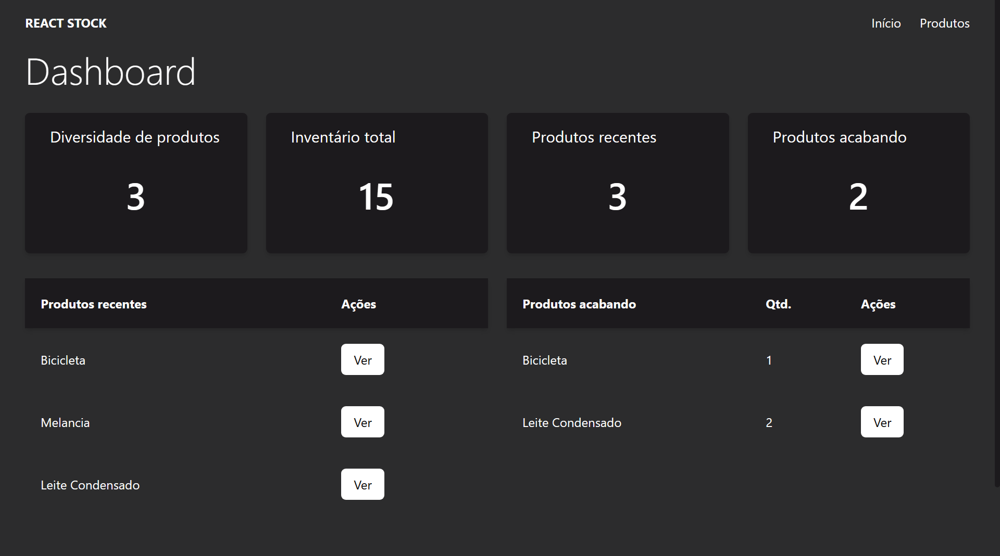
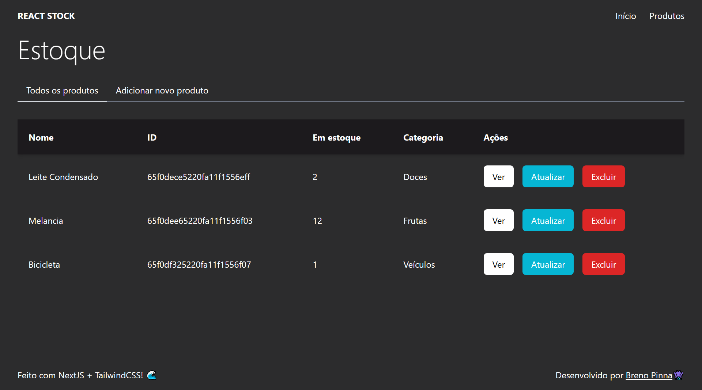
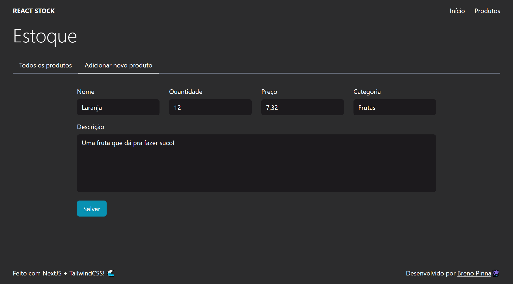
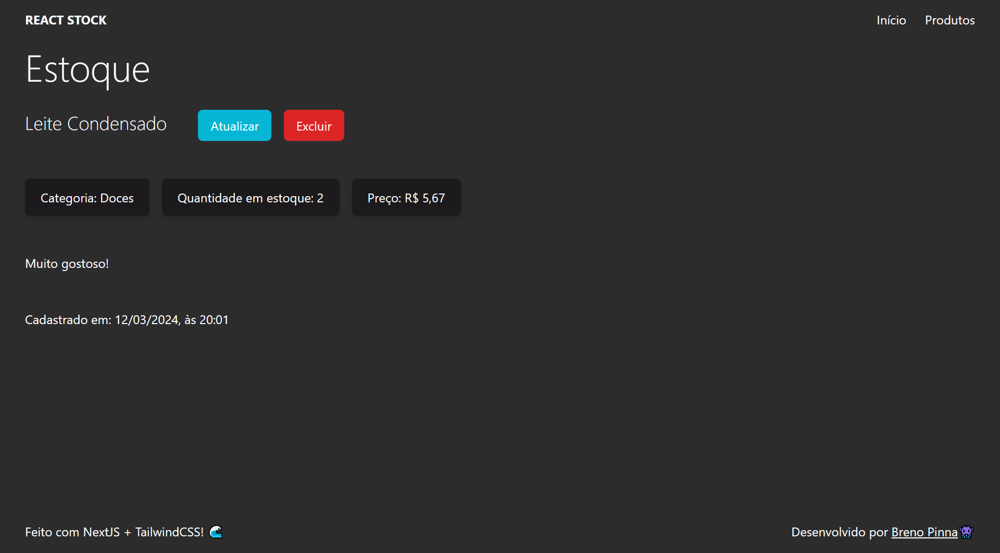
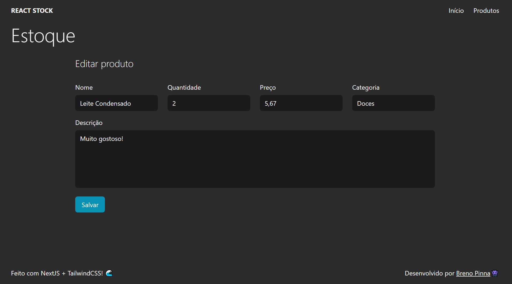
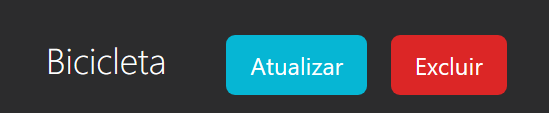

# Stock Manager: Fullstack (v1.0) 📦

## 🔍 Sobre o projeto

Stock Manager é uma aplicação que permite cadastrar produtos para o estoque de qualquer comércio.

## 🛠️ Tecnologias utilizadas

Frontend 👾

- NextJS
- Typescript
- TailwindCSS

Backend 👨‍💻

- Express
- Typescript
- Zod
- Mongoose
- Banco de dados MongoDB

Hospedagem 🌐

- Frontend: [Vercel](https://vercel.com/)
- Backend: [Railway](https://railway.app/)

## 📗 Guia do projeto

### Estrutura de arquivos

Na pasta [server](https://github.com/brenopinna/stock-manager-fullstack/tree/main/server), encontram-se todos os arquivos referentes ao backend da aplicação, e na pasta [web](https://github.com/brenopinna/stock-manager-fullstack/tree/main/web), os referentes ao frontend.

### Funcionalidades

É uma aplicação com as principais funções de um dashboard de estoque:

Na página principal, apresenta (caso tenha itens no estoque) um dashboard com informações sobre o estoque

Página principal

Na página `/products`, exibe uma lista de todos os produtos, além de uma barra de navegação que permite a criação de novos produtos.

Visualização dos produtos

Criação de um novo produto

Além disso, há funções para visualização e manipulação de um produto específico

Para visualizar essa página, basta clicar no botão `Ver` do produto que desejar.

Para editar, basta clicar no botão `Atualizar` do produto que desejar.

E para `Excluir` um produto, basta clicar no botão de mesmo nome.

## 🚧 Em desenvolvimento

- Funcionalidade de cadastro e login

## Agradecimentos

Obrigado por apoiar meu projeto!

Qualquer sugestão ou dúvida, mande um oi no discord! username: **_\_b011\__**
